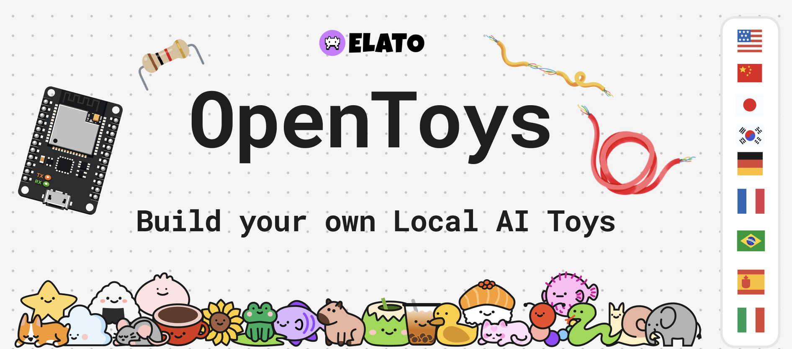
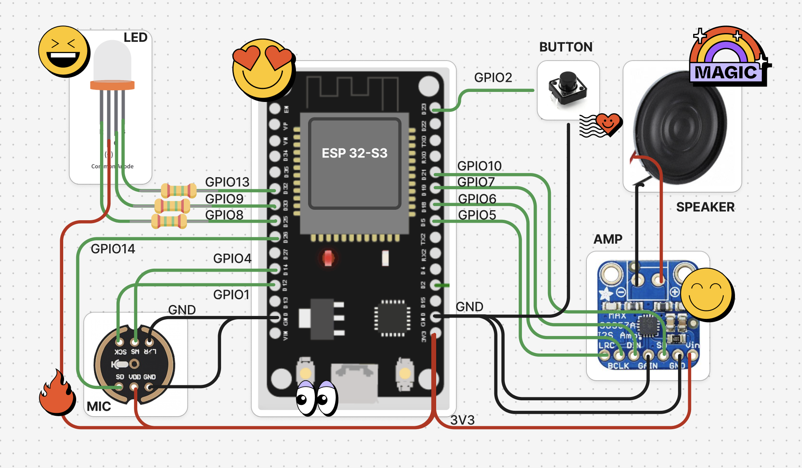

# 🎥 Demo Video

[](https://youtu.be/Ld5r6vXNiOM)

# OpenToys 

Build your own Local AI Toys, Desk Companions, Robots and more with an ESP32. OpenToys enables multilingual realtime speech with voice cloning andruns fully on-device on Apple Silicon without sending your data to the cloud.

## Why OpenToys?

- **Fully on-device**: No cloud, no subscriptions, no data leaving your home.
- **Multilingual**: OpenToys supports multiple languages: English, Chinese, Spanish, French, Japanese and more!
- **Voice Cloning**: Clone your own voice or your favorite characters with <10s of audio.
- **Customizable**: Build your own toys, companions, robots and more with an ESP32.
- **Open-source**: The community is open-source and free to use and contribute to.

## 🚀 Quick Start

1. Clone the repository with `git clone https://github.com/akdeb/open-toys.git`
2. Install Rust and Tauri with `curl https://sh.rustup.rs -sSf | sh`
3. Install Node from [here](https://nodejs.org/en/download)
4. Run `cd app`
5. Run `npm install`
6. Run `npm run tauri dev`

## ESP32 DIY Hardware



## ESP32-S3 GPIO Pins (recommended)
<table width="100%">
<tr>
<th align="left">Component / Signal</th>
<th align="left">Pin</th>
</tr>

<tr><td>Blue LED</td><td>13</td></tr>
<tr><td>Red LED</td><td>9</td></tr>
<tr><td>Green LED</td><td>8</td></tr>
<tr><td>I2S SD (Mic Data)</td><td>14</td></tr>
<tr><td>I2S WS (Mic LRCLK)</td><td>4</td></tr>
<tr><td>I2S SCK (Mic BCLK)</td><td>1</td></tr>
<tr><td>I2S WS OUT</td><td>5</td></tr>
<tr><td>I2S BCK OUT</td><td>6</td></tr>
<tr><td>I2S DATA OUT</td><td>7</td></tr>
<tr><td>I2S SD OUT</td><td>10</td></tr>
<tr><td>Button / Touchpad</td><td>2</td></tr>
</table>


## App Design


## Cards & Stories
Create experiences with personalities that can play games, tell stories, engage in educational conversations and more. Here are some example characters: Math Bear, Cosmo the Monkey, Bio Shark, Coach Carter and more!

<p align="center">


</p>

## Stack

- STT: Whisper Turbo ASR
- TTS: Qwen3-TTS and Chatterbox-turbo
- LLMs: any LLM from [`mlx-community`](http://huggingface.co/mlx-community) (Qwen3, Llama, Mistral3, etc.)
- App: Tauri, React, Tailwind CSS, TypeScript, Rust
- Platform focus: Apple Silicon (M1/2/3/4/5)
- Hardware device: ESP32-S3

## Download

- Direct DMG: [OpenToys_0.1.0_aarch64.dmg](https://github.com/akdeb/open-toys/releases/latest/download/OpenToys_0.1.0_aarch64.dmg)
- All releases: [GitHub Releases](https://github.com/akdeb/open-toys/releases)

## ⚡️ Flash to ESP32

1. Connect your ESP32-S3 to your Apple Silicon Mac.
2. In OpenToys, go to `Settings` and click `Flash Firmware`.
3. OpenToys flashes bundled firmware images (`bootloader`, `partitions`, `firmware`) directly.
4. After flashing, the toy opens a WiFi captive portal (`ELATO`) for network setup.
5. Put your Mac and toy on the same WiFi network; the toy reconnects when powered on while OpenToys is running.

## Tested on ✅

1. M1 Pro 2021 Macbook Pro
2. M3 2024 Macbook Air
2. M4 Pro 2024 Macbook Pro

## Project Structure

```
open-toys/
├── app/
├── arduino/
├── resources/
├────────── python-backend/
├────────── firmware/
└── README.md
```

Python 3.11 runtime binary, packages and HF models are downloaded on first app setup into the app data directory.

## License
MIT

---

If you like this project, consider supporting us with a star ⭐️ on GitHub!
